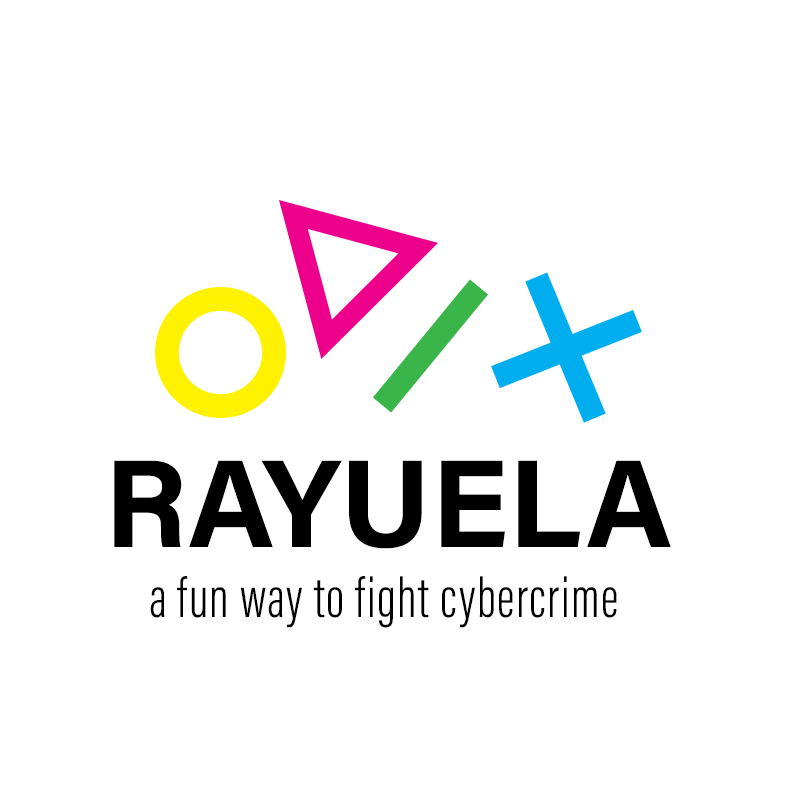
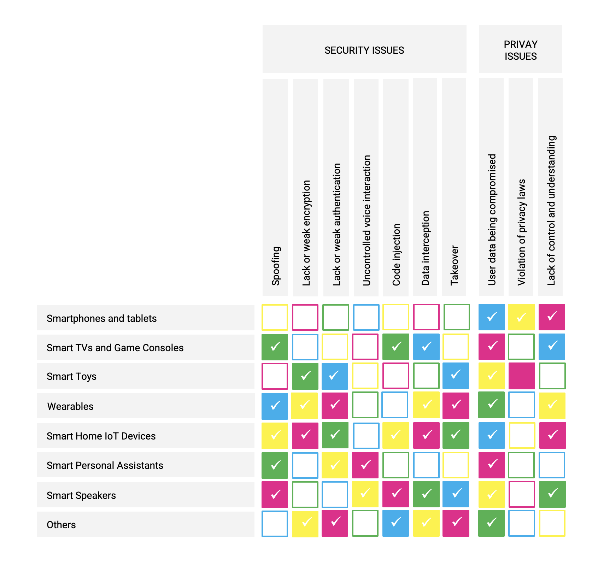
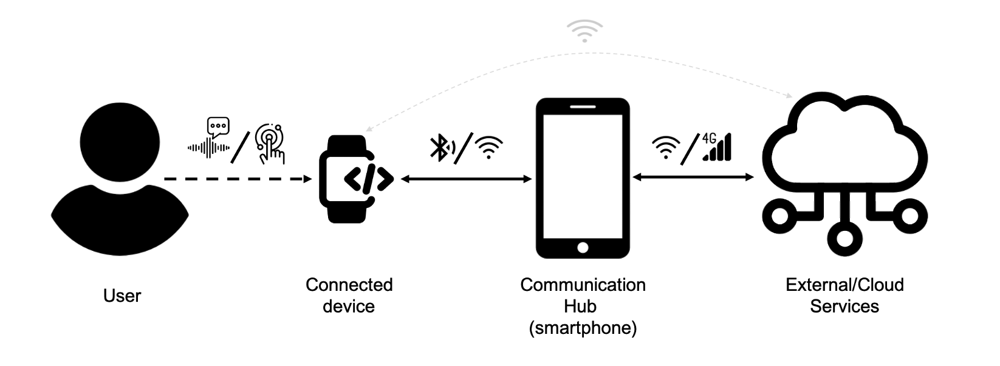

<!-- PROJECT LOGO -->
 

  

  

     
    <a href="https://www.rayuela-h2020.eu"><strong>Explore RAYUELA »</strong></a>
     
     
    
    
    
     
     
  

<!-- ABOUT US -->
## 

The European project RAYUELA ("empoweRing and educAting YoUng pEople for the internet by pLAying"), led by Comillas, is made up of a consortium of 17 partners from 9 European Union countries, including universities and research centres, law enforcement agencies and technology companies.
 
 
Its main mission is to empower and educate young people (children and teenagers primarily) in the benefits, risks and threats intrinsically linked to the use of the Internet by playing, thus preventing and mitigating cybercriminal behaviour. Our ideas stand a common belief that the internet has become an integral part of children and young people’s lives. The increased time spent online is prompting questions about whether they are in control of their internet usage. RAYUELA’s main goal is to better understand the drivers and human factors affecting certain relevant ways of cyber criminality, as well as empower and educate young people.
 
 
As a research project, RAYUELA aims to bring together law enforcement agencies (LEAs), sociologists, psychologists, anthropologists, legal experts, computer scientists and engineers, to develop novel methodologies that allow better understanding the factors affecting online behaviour related to new ways of cyber criminality, as well as promoting the potential of these young talents for cybersecurity and technologies.

  
(<a href="#top">back to top</a>)

<!-- ABOUT THE TASK -->
## 

  
  This repository includes information in relation to technology assessment and the IT threat landscape. For this purpose, we carried out a set of vulnerability tests and risk assessment of security issues linked to connected devices. These tests were approached from the point of view of the most common online threats for young people. In addition, Cybercrime-as-a-Service (Caas) models that exploit these Internet of Things (IoT) vulnerabilities were evaluated.
 
 
The main objective of this repository is therefore to describe and explain a methodology for the security and privacy rsisk assessment in IoT devices, as well as a catalogue of vulnerabilities in IoT devices frequently used by children and young people and sobre recommendations for risk mitigation. In addition, to support the methodology, this repository exposes a set of interesting tools for testing security and privacy vulnerabilities in the conext of the IoT. In addition, alongside the purely technological aspects, this methodology will consider the human factors affecting such vulnerabilities and their expoitation in new CaaS models. As a starting point, previous research has studied young people's use of connected devices and which devices they use most in their daily lives. This study resulted imn a categorisation of 7 types of connected devices that are widely uesd by young people:
 
 
1. Smartphones and tablets
 
2. Smart TVs and Game consoles
 
3. Smart toys
 
4. Wearables
 
5. Smart home IoT devices
 
6. Smart Personal Assistants
 
7. Smart speakers
 
8. Others, such as drones, cameras, or intimate devices
 
 
In addition, the security and privacy problems of these connected devices were analysed, which led to the definition of 7 security issues and 3 privacy issues, as described below:

    

  
All these problems have been analysed from technological, psychocological and socio-economic points of view, so that not only technological or engineering factors, but also human and socio-economic factors influencing the implementation, development and establishment of these problems and the urderlying threats have been assessed.
 
 

The methodology of security and privacy analysis tests applied to a set of devices belonging to the above categories has common steps. First, the operating and communication scheme commonly used by all current IoT devices underlies the evaluation scenario. An element with high computing power acts as an intermediary (hub, configurator, etc.) with external servers. Depending on the IoT device, BLE or the user's Wi-Fi hotspot supports communication with the master or hub. In turn, this scenario uses a wireless link to implement communication between the master or hub element. Special attention has been paid to the user's interaction with the specific devices when using voice commands.

    

This scenario shows three areas of analysis: one focused on the user-connected device interaction, a second on the communication between the connected device and the communication hub, and a third on the study of the communication process between external servers or third party applications and the hub system. Each area of analysis will define a case study to examine the security and privacy issues described in D2.1 by defining specific tests. In the case of LTE, communication between the communication hub and external/cloud servers is outside the scope of this analysis due to the cost associated with LTE/GSM monitoring tools and the underlying legal issues.
 
 
The analysis of the communications carried out within the defined scenario focuses on the study of all the information packets emitted by the devices involved in each test. For this reason, Wireshark was used as the default software tool for both BLE and Wi-Fi packet analysis. Wireshark is a communications packet analyser widely used in the field of telecommunications, both in academia and research. Moreover, it is an open source and multiplatform tool, which facilitates its adaptation to the hardware tools finally selected (plug-ins and addons) as well as to different operating systems. 
 
 
Do you want to check the security and privacy of your connected device?
  

<a href="https://rayuelaproject.github.io/App/">Automatic testing »</a>

<a href="https://rayuelaproject.github.io/Tests/">Manual testing »</a>

(<a href="#top">back to top</a>)

<!-- ACKNOWLEDGMENTS -->
## Acknowledgments

* 
<a href="https://github.com/othneildrew/Best-README-Template">GitHub Pages</a>

(<a href="#top">back to top</a>)

  

<!-- CONTACT -->
## Contact

Sonia Solera-Cotanilla 

sonia.solera@upm.com

(<a href="#top">back to top</a>)

  

